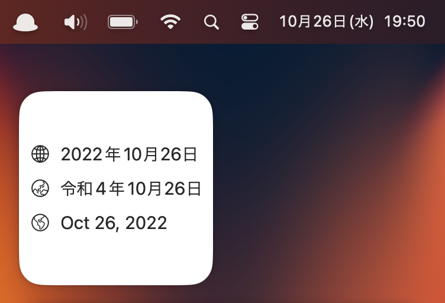

# Date



This is dead simple macOS app which provides full date in a Widget. That's it.

## Installation

```sh
brew tap griffin-stewie/formulae
brew install --cask griffin-stewie/formulae/date
```

## Thanks

The app icon designed by [Nob Nukui](https://nobtaka.com/)
